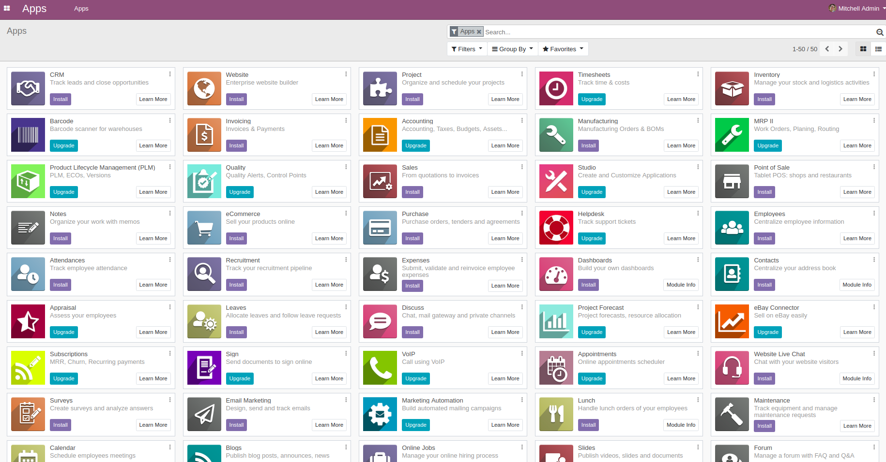
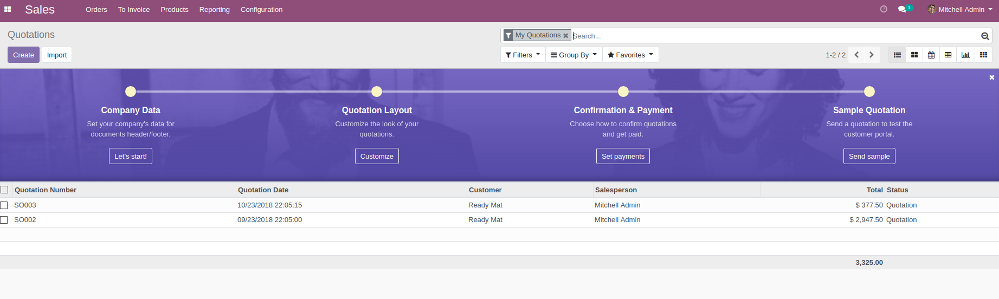

# Installing Odoo 12 with one command (supports multiple Odoo instances)

Install [docker](https://docs.docker.com/get-docker/) and [docker-compose](https://docs.docker.com/compose/install/) yourself, then run:

``` bash
# 1st Odoo @ localhost:10012
$ curl -s https://raw.githubusercontent.com/minhng92/odoo-12-docker-compose/master/run.sh | sudo bash -s odoo-12-docker-compose-1 10012
# 2nd Odoo @ localhost:11012
$ curl -s https://raw.githubusercontent.com/minhng92/odoo-12-docker-compose/master/run.sh | sudo bash -s odoo-12-docker-compose-2 11012
```

Some arguments:
* First argument (**odoo-12-docker-compose**): destination folder
* Second argument (**10012**): Odoo port

If `curl` is not found, install it:

``` bash
$ sudo apt-get install curl
# or
$ sudo yum install curl
```

# Usage

Change the folder permission to make sure that the container is able to access the directory:
```
$ sudo chmod -R 777 addons
$ sudo chmod -R 777 etc
$ mkdir -p postgresql
$ sudo chmod -R 777 postgresql
```

Increase maximum number of files watching from 8192 (default) to **524288**. In order to avoid error when we run multiple Odoo instances. This is an *optional step*:

```
$ if grep -qF "fs.inotify.max_user_watches" /etc/sysctl.conf; then echo $(grep -F "fs.inotify.max_user_watches" /etc/sysctl.conf); else echo "fs.inotify.max_user_watches = 524288" | sudo tee -a /etc/sysctl.conf; fi
$ sudo sysctl -p    # apply new config immediately
```

Start the container:
```
$ docker-compose up
```

* Then open `localhost:10012` to access Odoo 12.0. If you want to start the server with a different port, change **10012** to another value:

```
ports:
 - "10012:8069"
```

To run in detached mode, execute this command:

```
$ docker-compose up -d
```

# Custom addons

The **addons** folder contains custom addons. Just put your custom addons if you have any.

# Odoo configuration & log

* To change Odoo configuration, edit file: **etc/odoo.conf**
* Log file: **etc/odoo-server.log**

# Odoo container management

**Restart Odoo**:

``` bash
$ docker-compose restart
```

**Kill Odoo**:

``` bash
$ docker-compose down
```

# docker-compose.yml

* odoo:12.0
* postgres:9.5

# Odoo 12 screenshots





